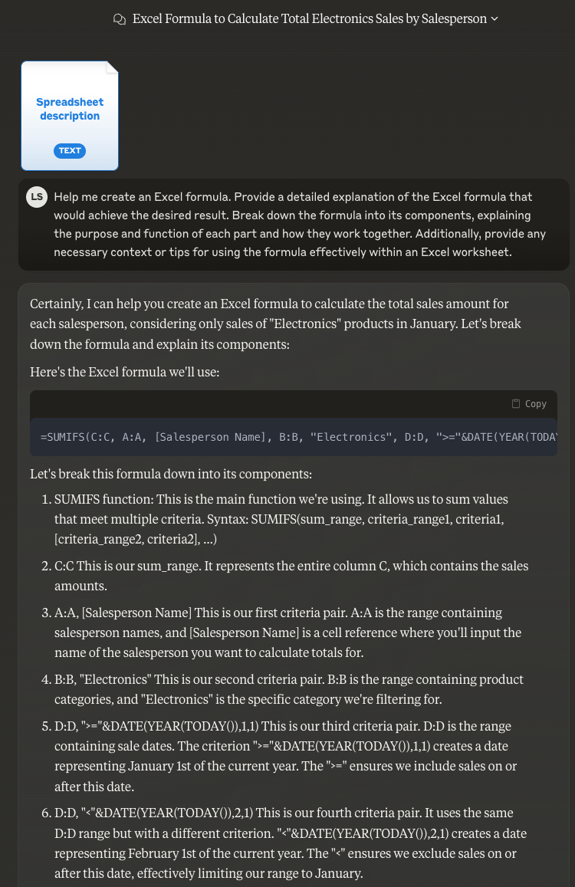

Help me create an Excel formula. Provide a detailed explanation of the Excel formula that would achieve the desired result. Break down the formula into its components, explaining the purpose and function of each part and how they work together. Additionally, provide any necessary context or tips for using the formula effectively within an Excel worksheet.

