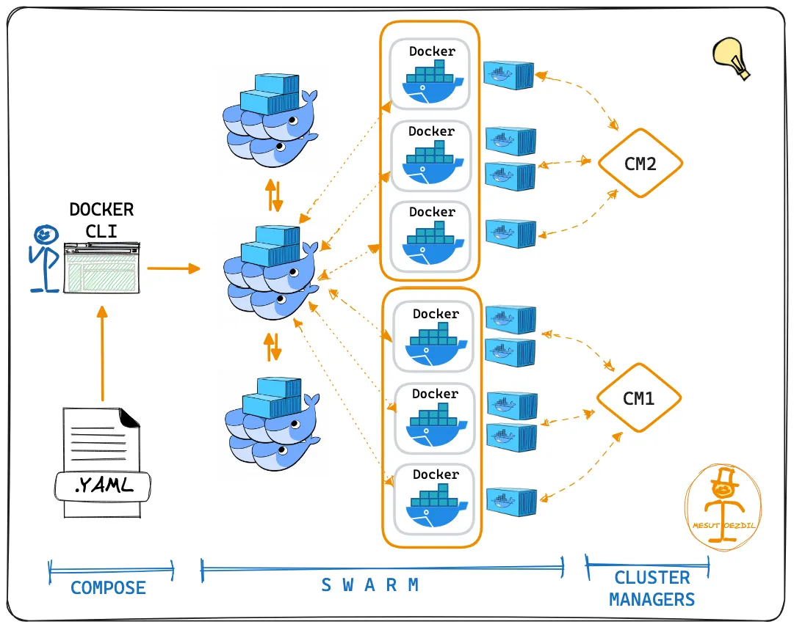

# [Docker Swarm](https://docs.docker.com/engine/swarm/)

Docker Swarm es una herramienta de orquestación de contenedores desarrollada por Docker. Permite crear y gestionar un clúster de nodos Docker (máquinas / host docker), coordinando los contenedores a través de estos nodos para lograr alta disponibilidad, escalabilidad y equilibrio de carga.

- Integración con Docker: Docker Swarm está completamente integrado con Docker, lo que facilita su uso si ya se está utilizando Docker
- Simplicidad: Es más fácil de configurar y gestionar en comparación con Kubernetes.
- Despliegue rápido: Permite desplegar servicios rápidamente con comandos Docker conocidos.
- Menos funciones avanzadas: Comparado con Kubernetes, Docker Swarm tiene menos características avanzadas y es menos flexible.
- Comunidad más pequeña: Menor soporte y comunidad en comparación con Kubernetes.
- Escalabilidad limitada: Menos efectivo en entornos muy grandes y complejos.

