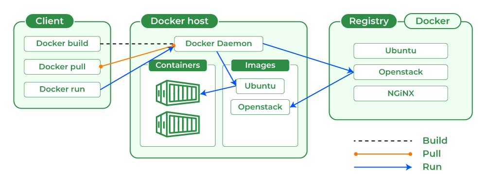

# [DOCKER](https://www.docker.com/)

Docker es una plataforma de software que permite a los desarrolladores crear, desplegar y ejecutar aplicaciones en contenedores. 

**Consistencia en el Entorno**: Asegura que la aplicación funcione de la misma manera en el entorno de desarrollo, pruebas y producción.

**Escalabilidad**: Facilita la escalabilidad horizontal de aplicaciones al permitir el despliegue de múltiples instancias de contenedores.

**Portabilidad**: Los contenedores pueden ejecutarse en cualquier lugar donde Docker esté disponible, ya sea en la máquina local, en servidores en la nube o en sistemas híbridos.

**Eficiencia**: Los contenedores son más ligeros que las máquinas virtuales porque comparten el núcleo del sistema operativo.

## ARQUITECTURA

Doker Daemon: Se ejecuta en el host y gestiona las imágenes y los contenedores (también denominado Docker Engine).

Docker Registry: Servicio que almacena y distribuye imágenes de Docker. Docker Hub es el registro público más común, pero se pueden configurar registros privados.



## DOCKER HELP

```bash
# Check the system Docker version
docker --version
> Docker version 20.10.22, build 3a2c30b

# Check the system Docker Compose version
docker compose version 
> Docker Compose version v2.27.1-desktop.1

# help 
docker --help
docker --help | grep image

# help command
docker run --help

# Mostrar información de todo el sistema
docker info
```

## DOCKER RUN

Run crea y ejecuta un nuevo contenedor desde una imagen

 1. El Docker client se puso en contacto con el Docker daemon.
 2. El Docker daemon extrajo la imagen "hello-world" del Docker Hub (arm64v8)
 3. El Docker Hub creó un nuevo contenedor a partir de esa imagen que ejecuta el archivo ejecutable que produce la salida que estás leyendo en este momento.
 4. El Docker Hub transmitió esa salida al cliente Docker, que la envió a su terminal.

```bash
# Ejecutar un contenedor simple:
docker run hello-world
```

## DOCKER BUILD

```bash
# Construye una imagen desde un Dockerfile
docker build -t <nombre_imagen> .
```

dockerfile

```bash
# Usar la imagen oficial de Python como base
FROM python:3.9

# Establecer el directorio de trabajo en /app
WORKDIR /app

# Copiar requirements.txt
COPY requirements.txt .

# Instalar las dependencias
RUN pip install --no-cache-dir -r requirements.txt

# Copiar el resto del código de la aplicación
COPY . .

# Exponer el puerto en el que la aplicación escucha
EXPOSE 5000

# Comando para ejecutar la aplicación
CMD ["python", "app.py"]
```

## DOCKER PULL

```bash
# Descarga una images desde registry
docker pull [OPTIONS] NAME[:TAG|@DIGEST]
```

## DOCKER PUSH

```bash
# Sube una image a registry
docker push [OPTIONS] NAME[:TAG]
```

## DOCKER EXEC

```bash
# Ejecuta un comando en un contenedor en ejecución.
docker exec [OPTIONS] NAME[:TAG]
```

## DOCKER CONTAINERS

Un container es una instancia en tiempo de ejecución de una Docker Image

```bash
# Listar contenedores activos:
docker ps
# Listar todos los contenedores (incluyendo los detenidos):
docker ps -a
docker ps -a | grep hello

# Detener un contenedor:
docker start [container_id]
docker start 8eb592582d53

# Detener un contenedor:
docker stop [container_id]
docker stop 8eb592582d53

# Eliminar un contenedor:
docker rm [container_id]
docker rm 8eb592582d53

# Log de un contenedor:
docker logs [container_id]
docker logs 8eb592582d53
```

## DOCKER IMAGES

Son plantillas de solo lectura usadas para crear contenedores. Pueden ser construidas desde un Dockerfile.

```bash
# Listar imágenes:
docker images
docker images | grep hello 

# Eliminar un contenedor:
docker rmi [image_id]
docker rmi ee301c921b8a 
docker rmi —force ee301c921b8a 
```

