#  GA4

<!--TOC-->

- [1. Properties](#1-properties)
  - [1.1 Subproperties](#11-subproperties)
- [2. Data Collection](#2-data-collection)
  - [2.1 Tagging for Google Analytics](#21-tagging-for-google-analytics)
  - [2.2 Data Streams](#22-data-streams)
  - [2.3 Google Signals](#23-google-signals)
  - [2.4 Sessions](#24-sessions)
  - [2.5 Data Retention](#25-data-retention)
- [3. Data display](#3-data-display)
  - [3.1 Events](#31-events)
  - [3.2 Dimensions](#32-dimensions)
  - [3.3 User ID](#33-user-id)
  - [3.4 DebugView](#34-debugview)
- [4. Product Links](#4-product-links)
  - [4.1 Google Ads Links](#41-google-ads-links)
  - [4.2 BigQuery Links](#42-bigquery-links)
- [5. Reports](#5-reports)

<!--TOC-->

## 1. Properties

### 1.1 Subproperties

> **\> Admin \> Property Settings \> Property \> Subproperty management**

Una subpropiedad es una propiedad que recibe datos filtrados de una propiedad fuente.

> [!IMPORTANT]  
> Hay que crear los data streams antes validar los identificadores de web y apps.

Docs
___

- [List of dimensions you can use to configure filter conditions](https://support.google.com/analytics/answer/11526072?hl=en#dimensions&zippy=%2Clist-of-dimensions-you-can-use-to-configure-filter-conditions)

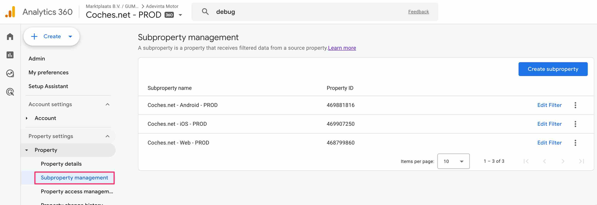

Filters
___

- Measurement ID: Unique WebSite  ID of your web. 
> **Example:** G-6NE7MBSF9K
- GMP app ID: Unique Firebase application ID of your application
> **Example:** 1:200592347366:android:27f39a56993c94fd

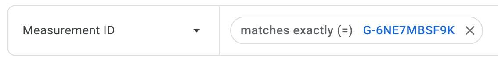
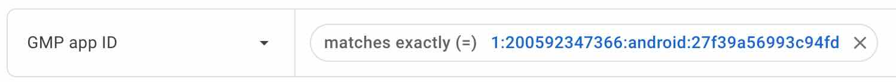
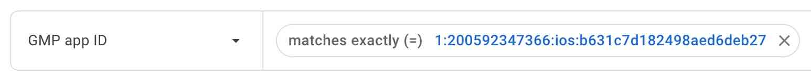

## 2. Data Collection

### 2.1 Tagging for Google Analytics

Configuration
___

> **\> Admin \> Property Settings \> Data collection and modification \> Data streams \> Configure tag settings \> Admin \> Install this Google Tag \> Install manually**

[Web](https://developers.google.com/analytics/devguides/collection/ga4/tag-options)
- https://luissalamo.blogspot.com/
- [El corte ingles](https://www.elcorteingles.es/)

| Tag | ID | URL| Destinations | 
|----------|:-----------------------------------|:-------------|:-------------|
| Google Tag | Measurement ID (G-6NE7MBSF9K) | https://www.googletagmanager.com/gtag/js?id=G-6NE7MBSF9K | Google Analytics / Google Ads |
| Google Tag Manager - **RECOMENDADO** | Container ID (GTM-NBTN82B) | https://www.googletagmanager.com/gtm.js?id=GTM-NBTN82B | Google Analytics / Google Ads |

Cookies
___

| Cookie Name | Default Expiration Time | Description | 
|----------|:-----------------------------------|:-------------|
| _ga | 2 años | Identificador de usuario |
| _ga\_\<container-id\> - _ga_6NE7MBSF9K | 2 años | Se utiliza para persistir el estado de la sesión. |

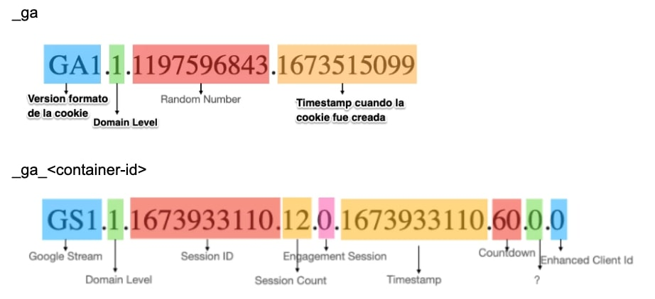

Google Tag
___

```html
<!-- Google tag (gtag.js) -->
<script async src="https://www.googletagmanager.com/gtag/js?id=G-6NE7MBSF9K"></script>
<script>
  window.dataLayer = window.dataLayer || [];
  function gtag(){dataLayer.push(arguments);}
  gtag('js', new Date());

  gtag('config', 'G-6NE7MBSF9K');
</script>
```

### 2.2 Data Streams

> **\> Admin \> Property Settings \> Data collection and modification \> Data streams**

- Cada propiedad de Google Analytics 4 puede tener hasta 50 data streams, que se pueden combinar entre data streams webs y apps.
- Genera un fragmento de código que agregas a tu aplicación o sitio para recopilar esos datos.
- Si elimina un flujo de datos, Analytics conserva los datos históricos, pero no se realiza ningún otro procesamiento de esos datos ni se pueden utilizar en filtros de informes.

> [!IMPORTANT]  
> Hay que consultar los "Firebase App ID" en la [consola de Firebase](https://console.firebase.google.com/)

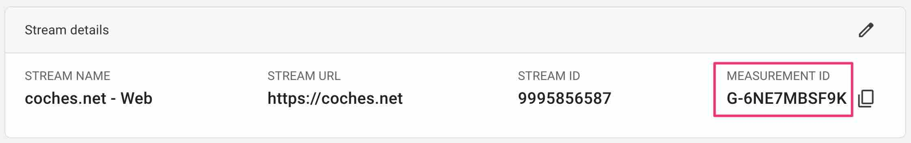
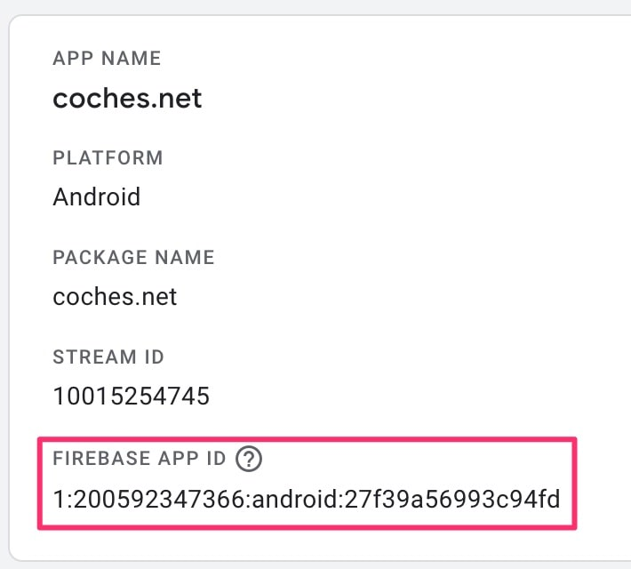
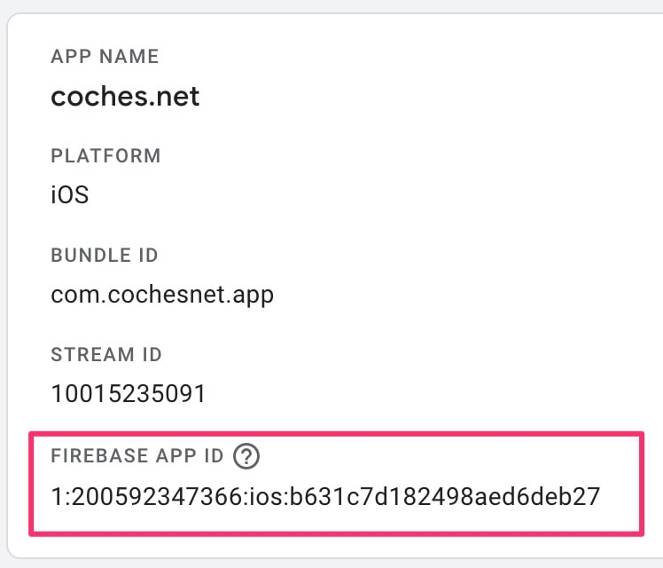

### 2.3 Google Signals

> **\> Admin \> Property Settings \> Data collection and modification \> Data colection \> Google signals data collection**

Completa los datos de los usuarios que acceden a un sitio web o una aplicación a través de dispositivos en los que han iniciado sesión en sus cuentas de Google y tienen habilitada la personalización de anuncios. Estos datos son demográficos, intereses, etc.

### [2.4 Sessions](https://support.google.com/analytics/answer/9191807)

Docs
___

- [measureschool.com - GA4 User Engagement Made Visual & Simple](https://measureschool.com/ga4-user-engagement/)

Configuration
___

Web

> **\> Admin \> Property Settings \> Data collection and modification \> Data streams \> Configure tag settings \> Configuration \> Adjust session timeout**

- **Session Timeout:** 30 minutos 
- **Engaged Session Timeout:** 10 segundos

[Android](https://firebase.google.com/docs/reference/android/com/google/firebase/analytics/FirebaseAnalytics#setSessionTimeoutDuration(long))

```js
// El valor predeterminado es 1800000 (30 minutos).
FirebaseAnalytics.getInstance(this).setSessionTimeoutDuration(1800000); 
```

[iOS](https://firebase.google.com/docs/reference/swift/firebaseanalytics/api/reference/Classes/Analytics#setsessiontimeoutinterval_:)

```js
// El valor predeterminado es 1800 segundos (30 minutos).
Analytics.setSessionTimeoutInterval(1800) 
```

User Engagement
___

En cuanto comienza una sesión con el evento "**session_start**", el reloj de GA4 empieza a contar. Ese tiempo se registra en milisegundos mediante el parámetro "**engagement_time_msec**".

Una sesión se considera "**engaged**" si cumple cualquiera de estas condiciones:
- La sesión dura más de 10 segundos (personalizable)
- La sesión tiene al menos una conversión
- La sesión tiene dos o más "page views".

En cuanto se produce una de las siguientes actividades y la sessión es "**engaged**", el tiempo transcurrido se envía a GA4. 
- El usuario pasa la pantalla de la aplicación al segundo plano.
- El usuario desvía la atención de su página web cambiando de pestaña o página.
- El usuario abandona la pantalla de la aplicación o la página web.
- El sitio o la aplicación fallan

Estos eventos no tienen el parámetro "**engagement_time_msec**" porque representan el comienzo de la interacción del usuario con una página
- page_view
- first_visit
- session_start

Example
___

Un usuario llega a la página principal de su sitio web, se desplaza hacia abajo después de 8 segundos y, a continuación, accede a una segunda página de su sitio web pasados 11 segundos. En la segunda página, el usuario se desplaza hacia abajo después de 6 segundos y, a continuación, abandona el sitio pasados 7 segundos.

El evento scroll o cualquier otro es informado con el parametro "**engagement_time_msec**" ya que esta disponible siempre que un usuario interacciona con el sitio web.

| Acción | Nombre del evento (en) | engagement_time_msec (_et) | engaged (seg) |
|----------|:-----------------------------------|:-------------| :-------------|
| Llega a la página principal | first_visit, page_view y session_start | N/A | 0 |
| Se desplaza hacia abajo en la página | scroll | 8781 | 0 |
| Accede a la siguiente página | user_engagement | 11856 | 1 |
| Llega a la segunda página | page_view | N/A | 1 |
| Se desplaza hacia abajo en la página | scroll | 6677 | 1 |
| Abandona el sitio web | user_engagement | 7711 | 1 |

### [2.5 Data Retention](https://support.google.com/analytics/answer/7667196)

> **\> Admin \> Property Settings \> Data collection and modification \> Data retention**

## 3. Data display

### 3.1 Events

> **\> Admin \> Property Settings \> Data Display \> Events**

- Collect: Desde aquí se muestran todos los eventos que llegan a través de todos los "Data Streams"
- Analyse: Si se quiere usar estos eventos para analizarlos debemos crear "Custom Events"

Docs
___

- [Google Drive Luis > Parameters, Dimensions and Metrics](https://docs.google.com/spreadsheets/d/1QlV_FyvvziEg-LXUa_8-Y0_i9y9H7T-a5zc0SG3oaUo/edit?gid=0#gid=0)
- [ Medium.com > GA4 Measurement Protocol Parameter Reference](https://medium.com/@mssvarma06/ga4-measurement-protocol-parameter-reference-b63d87bbe0eb)

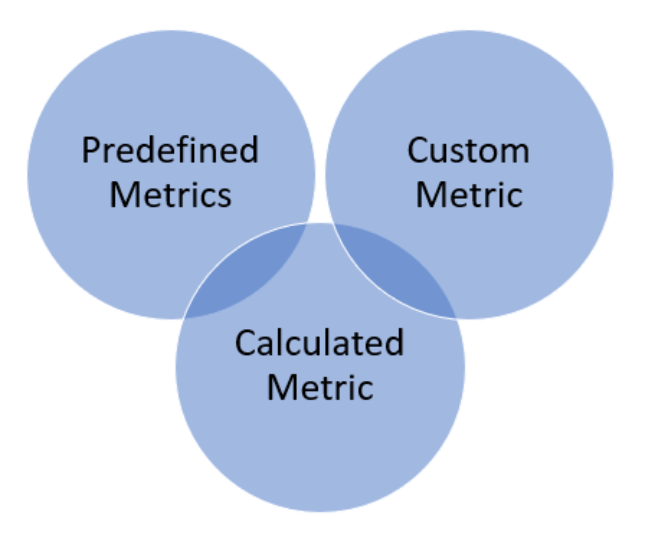

Predefined Metrics
___

- [Automatically collected events:](https://support.google.com/analytics/answer/9234069?hl=en&ref_topic=9756175) Son eventos que GA4 se recopilan automáticamente sin ninguna configuración adicional.
    - page_view: Triggered when a user views a page
    - first_visit: Recorded on a user's first visit to the site
    - session_start: Marks the beginning of a user session
    - user_engagement: 
- [Enhanced measurement events:](https://support.google.com/analytics/answer/9216061?hl=en&ref_topic=9756175) Son eventos que GA4 se recopilan automáticamente cuando se habilita la medición mejorada en la sección de configuación "Data Streams"
    - file_download
    - scroll
    - click
    - video_start, video_progress, video_complete
    - form_submit

- [Recommended events:](https://support.google.com/analytics/answer/9267735?hl=en&ref_topic=13367566&sjid=2826369473343199309-EU) Son eventos que implementas, pero que tienen nombres y parámetros predefinidos por GA4 en función de tu industria o negocio. Estos eventos desbloquean capacidades de generación de informes existentes y futuras.
    - view_item
    - add_to_wishlist
    - purchase
    - view_cart
    - view_promotion
    - remove_from_cart
    - view_item_list
    - select_item
    - add_shipping_info
    - add_payment_info

[Custom Metrics](https://support.google.com/analytics/answer/12229021?hl=en&ref_topic=13367566&sjid=2826369473343199309-EU)
___

> **\> Admin \> Property Settings \> Data Display \> Custom definitions \> Custom metrics**

Le permite analizar valores numéricos de los parámetros del evento

- Ad Replied Email
- Ad Phone Called
- Ad Deleted

Calculated Metrics
___

> **\> Admin \> Property Settings \> Data Display \> Custom definitions \> Calculated metrics**

Le permite combinar una o más métricas existentes y/o métricas personalizadas para producir una métrica nueva y potencialmente más valiosa.

Limits
___

| Types of custom dimension   |      Standard property      |  360 property |
|----------|:-------------:|------:|
| Custom metrics | 50 | 125 |
| Calculated metrics | 5 | 50 |

Parameters
___

URL Collect
```html
https://region1.google-analytics.com/g/collect
```

| Parameter (gtag) | Parameter (ga4) | Description |
|----------|:-------------|:------|
| tid |  | Measurement ID , identificador del stream para recoger la data |
| gtm |  | Container ID de GTM, identificador del contenedor de GTM |
| en | event_name | Nombre del evento |
| cid | client_id | Client ID, se obtiene de la cookie "_ga" generada por gtag |
| uid | user_id | User ID, identificador de usuario definido por nosotros |
| sid | ga_session_id | Session ID, se obtiene el tercer valor de la cookie  |
| sct | ga_session_number | Session Count, se obtiene el cuarto valor de la cookie |
| _fv | first_visit event | First Visit, indica que este es un evento de primera visita |
| _ss | session_start event | Session Start, indica que este evento inició una nueva sesión |
| seg | user_engagement event | Session Engagement, Define si la sesión está activa y tiene alguna interacción o no |
| _et | engagement_time_msec | Engagement Time, tiempo de interacción |
| _dbg | debug_mode | Si esta en modo debug |


### 3.2 Dimensions

3.2.1 Custom Dimensions

> **\> Admin \> Property Settings \> Data Display \> Custom definitions \> Custom dimensions**

Types
___

- **User-scoped (100 items)**: para informar de "user properties"

- **Event-scoped (125 items)**: para informar de "event parameters"

- **Item-scoped (25 items)**: para informat de "ecommerce parameters"

Steps
___

1. **Code:** Añades un evento con sus parametros o propiedades de usuario a tu código web o app.

2. **Collect:** Usuario visita tu web o app y la data es enviada a GA4

3. **Configuration:** Creamos "custom dimensions or metrics" para analizar la data. 

4. **Analyze:** Después de 24-48 horas tienes la data disponible para analizar. 

> **IMPORTANTE:** La creación de una dimensión personalizada con una gran cantidad de valores únicos puede afectar negativamente a sus informes. 

Limits
___

| Types of custom dimension | Standard property | 360 property |
|----------|:-------------:|------:|
| User-scoped custom dimensions | 25 | 100 |
| Event-scoped custom dimensions | 50 | 125 |
| Item-scoped custom dimensions | 10 | 25 |

### [3.3 User ID](https://support.google.com/analytics/answer/10976610)

> **\> Admin \> Property Settings \> Data Display \> Reporting Identity**

Google Analytics mide a los usuarios en distintos dispositivos y plataformas

- **User-ID:** Identificaciones persistentes para usuarios que iniciaron sesión. Es el más preciso, porque utiliza datos que usted recopila para identificar a sus usuarios.
> **Example:** sdrn:coches.net:user:12151777

```js
gtag('get', 'G-6NE7MBSF9K', 'user_id', (user_id) => {
  console.log('User ID:', user_id);
});

gtag("set", {user_id: "sdrn:coches.net:user:9560491"})
```

- **Device ID:** Analytics también puede utilizar el ID del dispositivo como espacio de identidad. En los sitios web, el ID del dispositivo obtiene su valor del "**client ID (first party cookie "_ga")**". En las aplicaciones, el ID del dispositivo es el "**app-instance-ID**".

```js
gtag('get', 'G-6NE7MBSF9K', 'client_id', (client_id) => {
  console.log('Client ID:', client_id);
});
```

- **Modeling:** GA4 se basa en el aprendizaje automático para modelar los datos del usuario para aquellos usuarios que se niegan a dar su consentimiento para compartir sus datos.

Types
___

- **Blended:** User-ID > device ID > modeling.
- **Observed:** User-ID > device ID. 
- **Device based:** device ID e ignora los otros

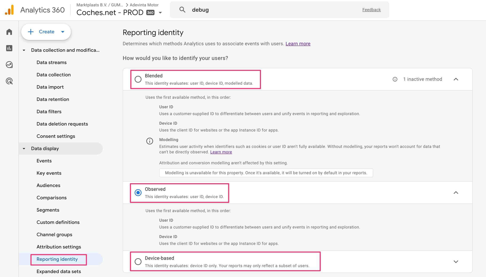

### [3.4 DebugView](https://support.google.com/analytics/answer/7201382)

Habilite el modo de depuración para uno mismo
- [Google Tag Assistant](https://tagassistant.google.com/)
    - [Tag Assistant Chrome Extension](https://chromewebstore.google.com/detail/tag-assistant/kejbdjndbnbjgmefkgdddjlbokphdefk)
- [Google Tag Manager](https://tagmanager.google.com/) > Preview Mode

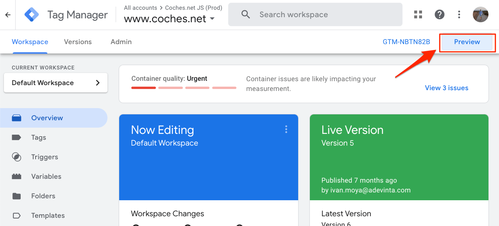

Habilitar el modo de depuración para todos

- Monitorear todos los eventos

```js
gtag('config', 'G-HFV6B7LKND', { 'debug_mode':true });
```

- Monitorear todos un evento

```js
gtag('event', 'xyz', { 'debug_mode':true });
```


Empiece a usar su sitio web o aplicación para monitorizar los eventos a medida que se activan.

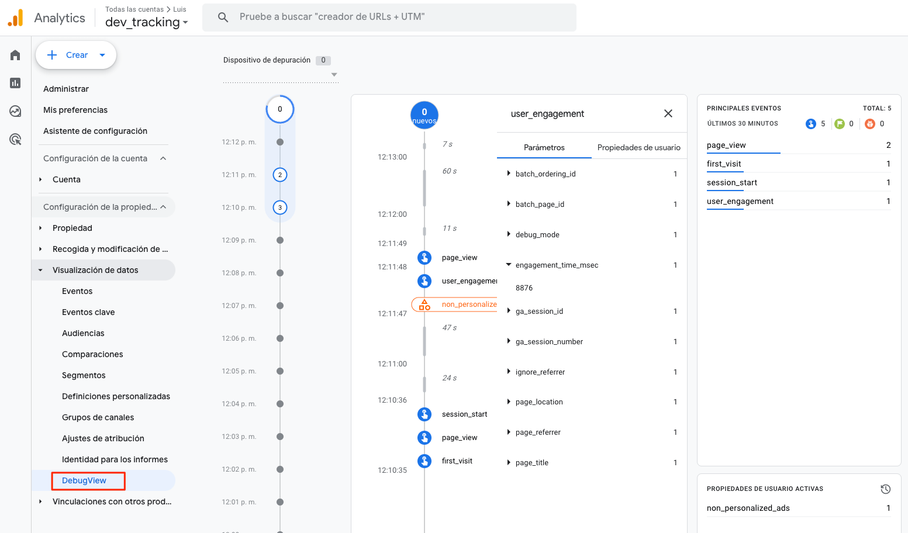

## 4. Product Links

> **\> Admin \> Property Settings \> Product Links**

Una de las principales ventajas competitivas de GA4 (gtag/firebase) es precisamente la activación de datos, gracias a su integración nativa con las plataformas de medios (Google Ads, DV360, SA360, etc.).

### 4.1 Google Ads Links

> **\> Admin \> Property Settings \> Product Links > Google Ads Links**

Docs
___

- [support.google.com > Connect Google Ads to Google Analytics](https://support.google.com/analytics/answer/9379420)
- [support.google.com > Share audiences in GA4 with your linked advertising products](https://support.google.com/analytics/answer/12800258?hl=en)

> [!NOTE] 
> Esta integración permite:
> 1. **Importación de conversiones:** Importamos las conversiones de GA4 a Google Ads para poder optimizar nuestras campañas en base a ellas. 
> 2. **Segmentación de audiencias:** Crear listas de remarketing dinámico basadas en el comportamiento de los usuarios en GA4.
> 3. **Análisis del rendimiento publicitario:** Combinar datos de GA4 con Google Ads para evaluar la efectividad de las campañas y ajustar estrategias en función del comportamiento de los usuarios.
> 4. **Casos de uso avanzados:** Por ejemplo, la creación de clústeres de usuarios mediante la integración de GA4 con un CRM en BigQuery, la generación de modelos de valor y, posteriormente, la importación de estas audiencias a GA4 para optimizar las pujas en Google Ads (aumentándolas para usuarios de alto valor y reduciéndolas para usuarios de menor valor).

### 4.2 BigQuery Links

> **\> Admin \> Property Settings \> Product Links > BigQuery Links**

Configure data streams and events
___

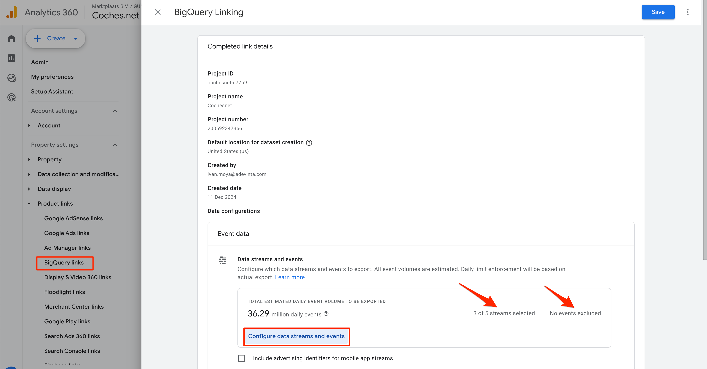

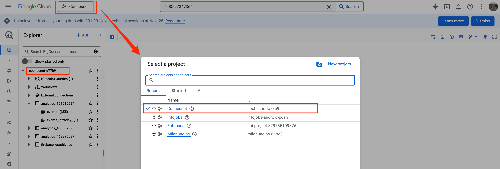

## [5. Reports](https://docs.google.com/document/d/17dhAOBJu9hX7p9ze_MtXraSu-uYJBjXSuY8xbzkcUDE/edit?tab=t.0#heading=h.nkfj3e8jo84o)


CONSENT MODE

analytics_storage='denied'
analytics_storage='granted'


BIGQUERY -> RAW DATA --> EVENTOS SIN PROCESAR
- Cuando desee obtener resultados más precisos de sus datos sin procesar, vea los resultados en BigQuery.
- Cuando desee resultados más eficientes, visualice los resultados en sus informes estándar y personalizados y en Explorations y Looker Studio.

> [!NOTE]  
> Highlights information that users should take into account, even when skimming.

> [!TIP]
> Optional information to help a user be more successful.

> [!IMPORTANT]  
> Crucial information necessary for users to succeed.

> [!WARNING]  
> Critical content demanding immediate user attention due to potential risks.

> [!CAUTION]
> Negative potential consequences of an action.


