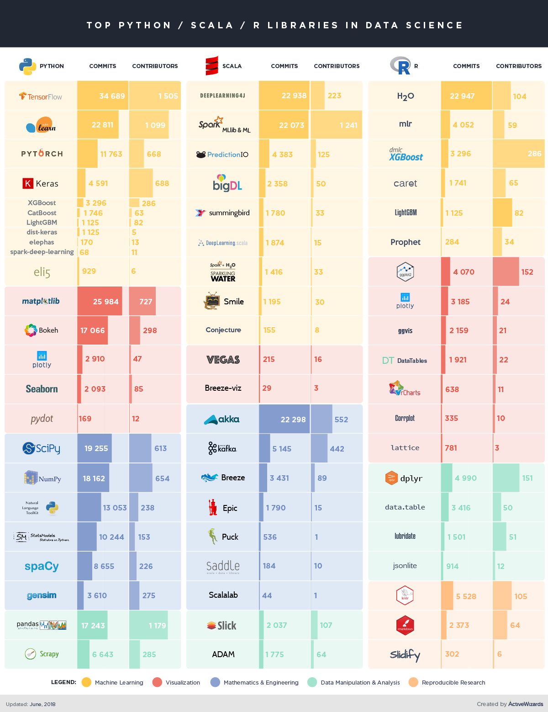

# MACHINE LEARNING



## [TENSORFLOW & KERAS](https://www.tensorflow.org/)

TensorFlow y Keras son bibliotecas de aprendizaje profundo que pueden ser utilizadas para construir modelos de redes neuronales para pronósticos más complejos.

```bash
# Install package
pip install tensorflow
```

Ejemplo básico de uso

```python
import tensorflow as tf
import numpy as np

# Crear datos de ejemplo
X = np.array(range(100)).reshape(-1, 1)
y = np.array(range(100))

# Crear un modelo secuencial
model = tf.keras.models.Sequential([
    tf.keras.layers.Dense(10, activation='relu', input_shape=(1,)),
    tf.keras.layers.Dense(1)
])

# Compilar el modelo
model.compile(optimizer='adam', loss='mse')

# Entrenar el modelo
model.fit(X, y, epochs=10)

# Hacer un pronóstico
X_future = np.array(range(100, 110)).reshape(-1, 1)
forecast = model.predict(X_future)
print(forecast)
```

```python
import numpy as np
from keras.models import Sequential
from keras.layers import LSTM, Dense
import matplotlib.pyplot as plt

# Generar datos simulados
np.random.seed(42)
data = np.random.rand(100) * 100  # 100 días de datos de demanda eléctrica
dias = np.arange(1, 101)
data = np.column_stack((dias, data))

# Normalizar los datos
data_norm = (data - np.mean(data, axis=0)) / np.std(data, axis=0)

# Preparar datos para LSTM
X, y = data_norm[:-1], data_norm[1:, 1]

X = X.reshape((X.shape[0], 1, X.shape[1]))

# Definir modelo LSTM
model = Sequential()
model.add(LSTM(50, activation='relu', input_shape=(1, 2)))
model.add(Dense(1))
model.compile(optimizer='adam', loss='mse')

# Entrenar modelo
model.fit(X, y, epochs=300, verbose=0)

# Predicción
yhat = model.predict(X, verbose=0)

# Desnormalizar los datos
yhat_desnorm = (yhat * np.std(data[:, 1])) + np.mean(data[:, 1])

# Gráfica
plt.figure(figsize=(10, 6))
plt.plot(dias, data[:, 1], label='Datos Reales de Demanda Eléctrica')
plt.plot(dias, yhat_desnorm, label='Predicción LSTM', color='red')
plt.title('Predicción de Demanda Eléctrica con LSTM')
plt.xlabel('Días')
plt.ylabel('Demanda Eléctrica')
plt.legend()
plt.show()
```


## [STATSMODELS](https://www.statsmodels.org/stable/index.html)

Statsmodels es una biblioteca para la estimación de modelos estadísticos y la realización de pruebas estadísticas. Es muy útil para el análisis de series temporales y el pronóstico.

```bash
# Install package
pip install statsmodels
```

Ejemplo básico de uso

```python
import statsmodels.api as sm

# Cargar datos de ejemplo
data = sm.datasets.co2.load_pandas().data

# Ajustar un modelo ARIMA
model = sm.tsa.ARIMA(data, order=(1, 1, 1))
results = model.fit()

# Hacer un pronóstico
forecast = results.forecast(steps=10)
print(forecast)
```

```python
import numpy as np
import pandas as pd
from statsmodels.tsa.arima.model import ARIMA
import matplotlib.pyplot as plt

# Generar datos simulados
np.random.seed(42)
data = np.random.rand(100) * 200  # 100 meses de datos de ventas
meses = pd.date_range('2020-01-01', periods=100, freq='M')
df = pd.DataFrame(data, index=meses, columns=['Ventas'])

# Dividir en train y test
train = df.iloc[:-10]
test = df.iloc[-10:]

# Modelo ARIMA
model = ARIMA(train, order=(5,1,0))  # Ejemplo: ARIMA(5,1,0)
model_fit = model.fit()

# Predicción
forecast = model_fit.forecast(steps=10)

# Métricas de error
mae = np.mean(np.abs(forecast - test['Ventas']))
rmse = np.sqrt(np.mean((forecast - test['Ventas'])**2))

print(f'MAE: {mae}')
print(f'RMSE: {rmse}')

# Gráfica
plt.figure(figsize=(10, 6))
plt.plot(train.index, train['Ventas'], label='Datos de Entrenamiento')
plt.plot(test.index, test['Ventas'], label='Datos Reales')
plt.plot(test.index, forecast, label='Predicción ARIMA', color='red')
plt.title('Predicción de Ventas con ARIMA')
plt.xlabel('Fecha')
plt.ylabel('Ventas')
plt.legend()
plt.show()
```

## [FACEBOOK-PROPHET](https://facebook.github.io/prophet/)

Prophet es una herramienta desarrollada por Facebook para realizar pronósticos en series temporales. Es especialmente útil para datos con tendencias y estacionalidades fuertes.

### LINKS

* [Medium.com > Forecasting in Python with Facebook Prophet](https://towardsdatascience.com/forecasting-in-python-with-facebook-prophet-29810eb57e66)
* [Medium.com > Forecasting con Prophet](https://medium.com/@angel.r.chicote/forecasting-con-prophet-7fb36b25eb4b)


```bash
# Install package
pip install prophet
```

Ejemplo básico de uso

```python
from prophet import Prophet
import pandas as pd

# Crear un DataFrame con los datos
df = pd.DataFrame({
    'ds': pd.date_range(start='2020-01-01', periods=100, freq='D'),
    'y': range(100)
})

# Ajustar el modelo
model = Prophet()
model.fit(df)

# Hacer un pronóstico
future = model.make_future_dataframe(periods=10)
forecast = model.predict(future)
print(forecast[['ds', 'yhat', 'yhat_lower', 'yhat_upper']].tail())
```

```python
import pandas as pd
from fbprophet import Prophet
import matplotlib.pyplot as plt

# Generar datos simulados
np.random.seed(42)
fechas = pd.date_range(start='2020-01-01', periods=100, freq='D')
ventas = np.random.rand(100) * 200
df = pd.DataFrame({'ds': fechas, 'y': ventas})

# Ajustar modelo Prophet
model = Prophet()
model.fit(df)

# Crear dataframe futuro y predecir
future = model.make_future_dataframe(periods=30)
forecast = model.predict(future)

# Gráfica
fig1 = model.plot(forecast)
plt.title('Predicción de Ventas con Prophet')
plt.xlabel('Fecha')
plt.ylabel('Ventas')
plt.show()

# Componentes de la predicción
fig2 = model.plot_components(forecast)
```

## [SCIKIT-LEARN](https://scikit-learn.org/stable/)

scikit-learn es una biblioteca de aprendizaje automático en Python que incluye varias herramientas para el pronóstico, aunque no está enfocada específicamente en series temporales. Se puede utilizar en combinación con otras bibliotecas.

```bash
# Install package
pip install scikit-learn
```

Ejemplo básico de uso

```python
from sklearn.linear_model import LinearRegression
import numpy as np

# Crear datos de ejemplo
X = np.array(range(100)).reshape(-1, 1)
y = np.array(range(100))

# Ajustar el modelo
model = LinearRegression()
model.fit(X, y)

# Hacer un pronóstico
X_future = np.array(range(100, 110)).reshape(-1, 1)
forecast = model.predict(X_future)
print(forecast)
```
