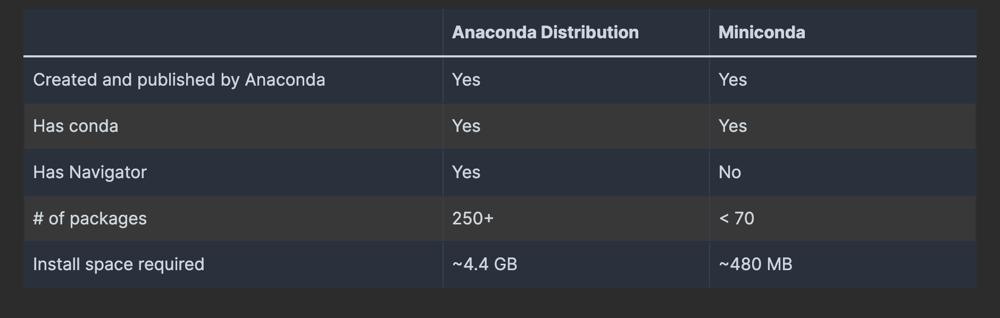

# CONDA

<!--TOC-->

- [CONDA](#conda)
  - [LINKS](#links)
  - [INSTALATION](#instalation)
  - [VIRTUAL ENVIRONMENTS](#virtual-environments)
    - [conda activate / deactivate](#conda-activate--deactivate)
    - [conda env create](#conda-env-create)
    - [conda env update](#conda-env-update)
    - [conda env remove](#conda-env-remove)
    - [conda env list](#conda-env-list)
    - [conda env export](#conda-env-export)
    - [Create the environment from file](#create-the-environment-from-file)
    - [Create the environment from the environment.yml file](#create-the-environment-from-the-environmentyml-file)
    - [Restoring an environment](#restoring-an-environment)
  - [PACKAGES](#packages)
    - [conda create](#conda-create)
    - [conda install](#conda-install)
    - [conda update](#conda-update)
    - [conda remove](#conda-remove)
    - [conda list](#conda-list)
  - [VARIABLES](#variables)
    - [Saving environment variables for secret keys](#saving-environment-variables-for-secret-keys)

<!--TOC-->

---

Conda es un gestor de paquetes y entornos enfocado principalmente en la ciencia de datos y el desarrollo en Python.

```bash
# Check conda version
conda -V
conda --version
> conda 24.5.0

# Information about Conda Version
conda info

# Help commands
conda <command> -h
conda <command> --help

# Location of python directory
which conda
> /opt/anaconda3/bin/conda
```

## LINKS
- [Official Website](https://conda.io/)
- [Documentation](https://docs.conda.io/)
- [Commands](https://docs.conda.io/projects/conda/en/stable/commands/index.html)
- [Releases](https://docs.conda.io/projects/conda/en/stable/release-notes.html)

## INSTALATION



```bash
# Update the conda package manager to the latest version in your base environment
conda update -n base conda
# Use conda to update Anaconda to the latest version in your base environment
conda update -n base anaconda
```

[ANACONDA DISTRIBUTION](https://docs.anaconda.com/anaconda/install/)

[MINICONDA](https://docs.anaconda.com/miniconda/)

```bash
# homebrew
brew install miniconda
```

download [miniconda installer](https://docs.conda.io/projects/conda/en/stable/#conda-documentation) for mac 

## VIRTUAL ENVIRONMENTS

### conda activate / deactivate

```bash
# Activate an environment
conda activate [env_name]
# equivale a: source /opt/anaconda3/envs/python-env/bin/activate
conda activate python-env

# Deactivate an environment
conda deactivate
# equivale a: deactivate
```

### conda env create

```bash
# Create an environment based on an environment definition file
conda env create
conda env create -n [env_name]
conda env create folder/envname
conda env create -f /path/to/environment.yml
conda env create -f /path/to/requirements.txt -n [env_name]
conda env create -f /path/to/requirements.txt -p /home/user/envname
```

### conda env update

```bash
# Update the current environment based on environment file
conda env update
conda env update -n=[env_name]
conda env update -f=/path/to/environment.yml
conda env update --name=[env_name] --file=environment.yml
conda env update vader/deathstar
```

### conda env remove

```bash
# Remove an environment
conda env remove -n [env_name]
conda env remove --name [env_name]
```

### conda env list

```bash
# List the Conda environments
conda env list
conda env list --json 
conda info -e
conda info --envs
> base                     /opt/anaconda3
> python-env            *  /opt/anaconda3/envs/python-env

# Locate the directory for the activated conda environment
echo $CONDA_PREFIX
> /opt/anaconda3/envs/python-env
```

### conda env export

```bash
# Export a given environment
conda env export
conda env export --file environment.yml
conda env export > environment.yml
```

### Create the environment from file

```bash
# Save packages for future use
conda list --export > package-list.txt

# Reinstall packages from an export file
conda create -n [env_name] --file package-list.txt
```

### Create the environment from the environment.yml file

LINKS
- [Create the environment from the environment.yml file](https://docs.conda.io/projects/conda/en/latest/user-guide/tasks/manage-environments.html#creating-an-environment-from-an-environment-yml-file)

```bash
# Exporting the environment.yml file
conda env export > environment.yml

# Create the environment from the environment.yml file:
conda env create -f environment.yml
conda activate [env_name]
```

Example file environment.yml

```json
name: python-env
channels:
  - defaults
dependencies:
  - openssl=3.0.13
  - pip=24.0
  - python=3.12.3
  - setuptools=69.5.1
  - sqlite=3.45.3
  - wheel=0.43.0
  - conda-forge::numpy=1.21.*
  - nodejs=16.13.*  
  - pip
  - pip:
    - Flask-Testing  
variables:
  var1: value1
```

### Restoring an environment

```bash
# Restoring an environment
conda list --revisions
conda install --revision=REVNUM # To restore environment to a previous revision
conda install --rev 8 # restore your environment to revision 8

# Updating our project with new dependencies
conda env update --file environment.yml
```

## PACKAGES

### conda create

Create a new conda environment from a list of specified packages.

```bash
# Create an environment containing the package 'sqlite'
conda create -n [env_name] sqlite
conda create --name [env_name] python=3.8
conda create --name [env_name] r-essentials r-base

# Create an environment (env2) as a clone of an existing environment (env1)
conda create -n env2 --clone path/to/file/env1
```

### conda install

```bash
# Install package_name to latest version
conda install [package_name]

# Install package_name to v5.0
conda install [package_name]=5.0.0
```

### conda update

```bash
# Update conda packages to the latest compatible version
conda update -n [env_name] [package_name]
```

### conda remove

```bash
# Remove a list of packages from an environment 
conda remove scipy
conda remove -n [env_name] scipy curl wheel

# Delete environment and packages
conda remove --name [env_name] --all
```

### conda list

```bash
# List packages installed
conda list

# List all packages installed into the environment
conda list -n [env_name]

# List all packages that begin with the letters "py", using regex
conda list ^py
conda list | grep ^py
```

## VARIABLES

```bash
# List any variables you may have
env

# List any variables you may have
conda env config vars list
conda env config vars list -n [env_name]

# Set environment variables
conda env config vars set [var1]=[value1]
conda env config vars set [var1]=[value1] [var2]=[value2]
echo $my_var

# Unset the environment variable
conda env config vars unset [var1]
```

### Saving environment variables for secret keys

LINKS 

- [Saving environment variables for secret keys](https://docs.conda.io/projects/conda/en/latest/user-guide/tasks/manage-environments.html#saving-environment-variables)

```bash
# Enter that directory and create these subdirectories and files:
cd $CONDA_PREFIX
mkdir -p ./etc/conda/activate.d
mkdir -p ./etc/conda/deactivate.d
touch ./etc/conda/activate.d/env_vars.sh
touch ./etc/conda/deactivate.d/env_vars.sh

# Edit ./etc/conda/activate.d/env_vars.sh as follows:
#!/bin/sh
export MY_KEY='secret-key-value'
export MY_FILE=/path/to/my/file/

# Edit ./etc/conda/deactivate.d/env_vars.sh as follows:
#!/bin/sh
unset MY_KEY
unset MY_FILE
```
