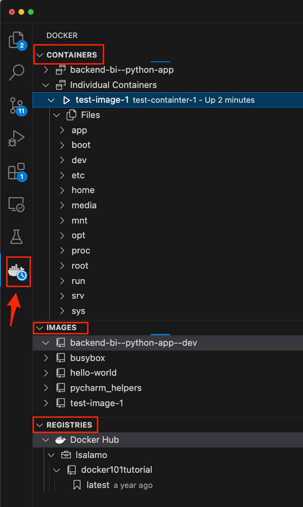
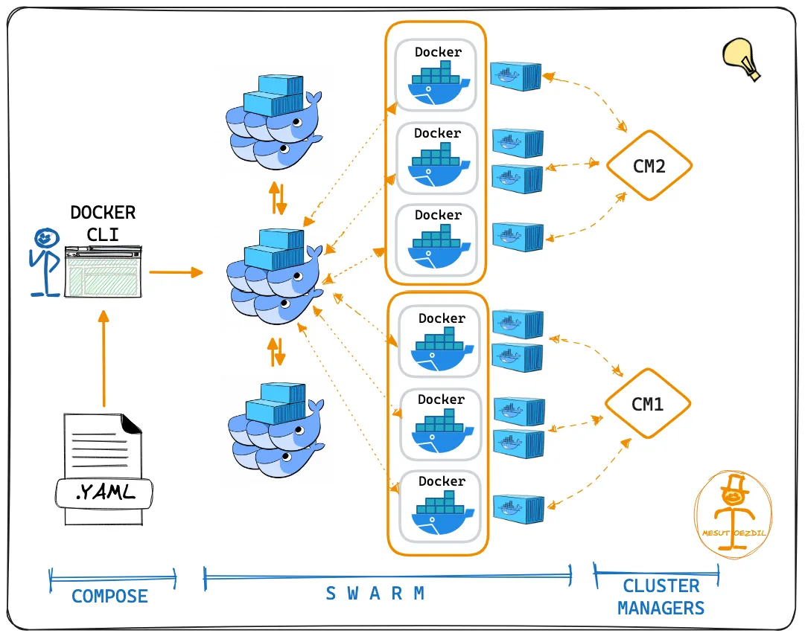

# [DOCKER](https://www.docker.com/)

Docker es una plataforma de software que permite a los desarrolladores crear, desplegar y ejecutar aplicaciones en contenedores. 

**Consistencia en el Entorno**: Asegura que la aplicación funcione de la misma manera en el entorno de desarrollo, pruebas y producción.

**Escalabilidad**: Facilita la escalabilidad horizontal de aplicaciones al permitir el despliegue de múltiples instancias de contenedores.

**Portabilidad**: Los contenedores pueden ejecutarse en cualquier lugar donde Docker esté disponible, ya sea en la máquina local, en servidores en la nube o en sistemas híbridos.

**Eficiencia**: Los contenedores son más ligeros que las máquinas virtuales porque comparten el núcleo del sistema operativo.

## ARQUITECTURA

Doker Daemon: Se ejecuta en el host y gestiona las imágenes y los contenedores (también denominado Docker Engine).

Docker Registry: Servicio que almacena y distribuye imágenes de Docker. Docker Hub es el registro público más común, pero se pueden configurar registros privados.


## GENERAL COMMANDS

```bash
# Check the system Docker version
docker --version
> Docker version 20.10.22, build 3a2c30b

# Check the system Docker Compose version
docker compose version 
> Docker Compose version v2.27.1-desktop.1

# help 
docker --help
docker --help | grep image

# help command
docker run --help

# Mostrar información de todo el sistema
docker info
```

## DOCKER EXEC

```bash
# Ejecuta un comando en un contenedor en ejecución.
docker exec [OPTIONS] NAME[:TAG]

# Passing Environment Variables into a Docker Container
docker exec -e TEST=sammy [container-name] env
```

## DOCKER IMAGES

Son plantillas de solo lectura usadas para crear contenedores. Pueden ser construidas desde un Dockerfile.

```bash
# Construye una imagen desde un Dockerfile
docker build -t [image_name] [project_docker]
docker build -t test-image-1 ./dev/package_management/docker/example 

# Listar imágenes:
docker images
docker images | grep hello 

# Eliminar un contenedor:
docker rmi [image_id]
docker rmi ee301c921b8a 
docker rmi —force ee301c921b8a 
```

## DOCKER CONTAINERS

Un container es una instancia en tiempo de ejecución de una Docker Image

```bash
# Crea y ejecuta un nuevo contenedor desde una imagen
docker run [image_name]
docker run hello-world # Docker Hub
docker run test-image-1 # local image
docker run -d test-image-1 # run in background

# Crea y ejecuta un nuevo contenedor desde una imagen con un nombre personalizado
docker run --name [container_name] [image_name]
docker run -p [host_port]:[container_name] [image_name]
docker run --name test-container-1 test-image-1

# Listar contenedores activos
docker ps
> CONTAINER ID   IMAGE                        COMMAND               CREATED       STATUS       PORTS                    NAMES
> e6d7359fc485   docker_compose_example-web   "flask run --debug"   3 hours ago   Up 2 hours   0.0.0.0:8000->5000/tcp   docker_compose_example-web-1

# Listar todos los contenedores (incluyendo los detenidos)
docker ps -a
docker ps -a | grep hello

# Detener un contenedor
docker start [container_id]
docker start test-container-1 
docker start f68ebe135f70dc408658746b92827484b73ef9380d396f8357bdab0ffdbbbec5

# Detener un contenedor
docker stop [container_id]
docker stop test-container-1 
docker stop f68ebe135f70dc408658746b92827484b73ef9380d396f8357bdab0ffdbbbec5

# Eliminar un contenedor
docker rm [container_id]
docker rm test-container-1 
docker rm f68ebe135f70dc408658746b92827484b73ef9380d396f8357bdab0ffdbbbec5

# Log de un contenedor
docker logs [container_id]
docker logs test-container-1 
docker logs f68ebe135f70dc408658746b92827484b73ef9380d396f8357bdab0ffdbbbec5

# Abrir un shell dentro de un Docker Container en ejecución
docker exec -it [container_id] sh 
docker exec -it test-container-1 sh 

# Ver estadísticas de uso de recursos
docker container stats

# Inspeccionar un contenedor en ejecución
docker inspect [container_id]
docker inspect test-containter-1 
```

## [DOCKER HUB](https://hub.docker.com/)

Docker Hub es un servicio proporcionado por Docker para encontrar y compartir imágenes de contenedores con su equipo. 

### LINKS
- [Docker Official Images](https://hub.docker.com/search?image_filter=official) - Imágenes más seguras y confiables en Docker Hub
- [Verified Publisher](https://hub.docker.com/search?image_filter=store) - Imágenes de alta calidad publicadas y mantenidas por las organizaciones asociadas con Docker
- [Docker Sponsored Open Source](https://hub.docker.com/search?image_filter=open_source) - Son publicados y mantenidos por proyectos de código abierto patrocinados por Docker

```bash
# Login into Docker 
docker login -u [username] 
docker login -u lsalamo 

# Sube una image a Docker Hub (Registry)
docker push <username>/<image_name> 

# Search Hub for an image 
docker search <image_name> 

# Descarga una images desde Docker Hub (Registry)
docker pull <image_name>
```
### IMAGES VARIANTS

- **python:\<version>**: Si no está seguro de cuáles son sus necesidades, probablemente desee utilizar este. Está diseñado para usarse como contenedor desechable
- **python:\<version>-slim**: Esta imagen no contiene los paquetes comunes de Debian contenidos en la etiqueta predeterminada y solo contiene los paquetes mínimos de Debian necesarios para ejecutar Python.
- **python:\<version>-alpine**: Esta imagen está basada en el popular [Alpine Linux project](https://alpinelinux.org/), disponible en la la [Alpine official image](https://hub.docker.com/_/alpine). Alpine Linux es mucho más pequeño que la mayoría de las imágenes base de distribución (~5 MB) y, por lo tanto, genera imágenes mucho más delgadas en general.
- **python:\<version>-windowsservercore**: Solo funciona en lugares como Windows 10 Professional/Enterprise (Edición de aniversario) o Windows Server 2016.



## [DOCKER COMPOSE](https://docs.docker.com/compose/)

Es una herramienta para definir y ejecutar aplicaciones Docker multicontenedor. Permite configurar la infraestructura de una aplicación a través de un archivo YAML (docker-compose.yml)

- No es ideal para entornos de producción a gran escala
- No proporciona características avanzadas de orquestación como autoescalado o autoreparación.

```bash
# Check the system Docker Compose version
 docker compose version 
> Docker Compose version v2.27.1-desktop.1

# List running compose containers
docker compose ls
> NAME                     STATUS              CONFIG FILES
> docker_compose_example   running(1)          /Users/luis.salamo/Documents/github/dev/docker_compose_example/compose.yaml

# Create and start containers
docker compose up

# Stop and remove containers, networks
docker compose down

# List of envrionments variables
env
echo $FLASK_APP
```

## [DOCKER SWARM](https://docs.docker.com/engine/swarm/)

Docker Swarm es una herramienta de orquestación de contenedores desarrollada por Docker. Permite crear y gestionar un clúster de nodos Docker (máquinas / host docker), coordinando los contenedores a través de estos nodos para lograr alta disponibilidad, escalabilidad y equilibrio de carga.

- Integración con Docker: Docker Swarm está completamente integrado con Docker, lo que facilita su uso si ya se está utilizando Docker
- Simplicidad: Es más fácil de configurar y gestionar en comparación con Kubernetes.
- Despliegue rápido: Permite desplegar servicios rápidamente con comandos Docker conocidos.
- Menos funciones avanzadas: Comparado con Kubernetes, Docker Swarm tiene menos características avanzadas y es menos flexible.
- Comunidad más pequeña: Menor soporte y comunidad en comparación con Kubernetes.
- Escalabilidad limitada: Menos efectivo en entornos muy grandes y complejos.

