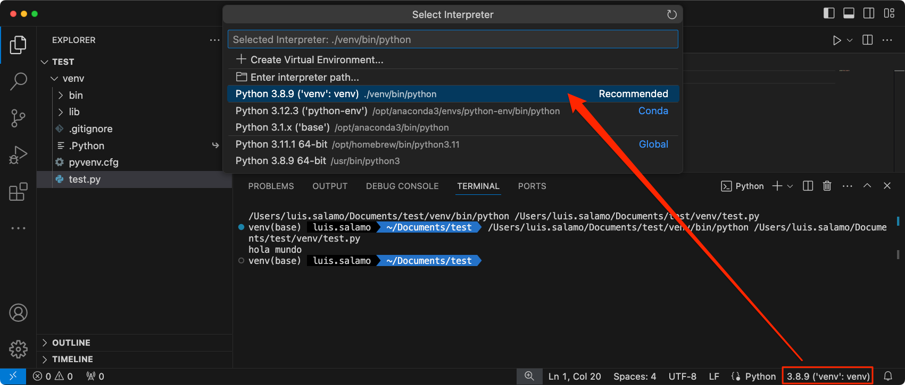

# [PACKAGE INSTALLER FOR PYTHON (PIP)](https://pip.pypa.io/)

<!--TOC-->

- [LINKS](#links)
- [INSTALATION](#instalation)
  - [1. ensurepip](#1-ensurepip)
  - [2. get-pip.py](#2-get-pippy)
  - [3. Actualice su pip ejecutando](#3-actualice-su-pip-ejecutando)
- [VIRTUAL ENVIRONMENTS](#virtual-environments)
  - [venv](#venv)
  - [virtualenv](#virtualenv)
  - [Create the environment from the requirements.txt file](#create-the-environment-from-the-requirementstxt-file)
  - [pip freeze](#pip-freeze)
- [PACKAGES](#packages)
  - [pip install](#pip-install)
  - [pip uninstall](#pip-uninstall)
  - [pip list](#pip-list)
  - [pip show](#pip-show)
  - [pip search](#pip-search)
- [VARIABLES](#variables)

<!--TOC-->

---

La herramienta más popular para instalar paquetes de Python y la que se incluye con las versiones modernas de Python.
- Proporciona las funciones principales esenciales para buscar, descargar e instalar paquetes desde [PyPI](https://pypi.org/) y otros índices de paquetes de Python.
- Gestiona dependencias, asegurando que todas las dependencias necesarias para un paquete estén instaladas
- Soporta la instalación de archivos .whl, archivos de distribución de origen, y otros formatos
- Facilita la gestión de entornos virtuales y la instalación de paquetes en entornos específicos

```bash
# Check the system Python version
python --version
> Python 3.11.7

# Check pip version
pip --version 
python -m pip --version
> pip 23.3.1 from /opt/anaconda3/lib/python3.11/site-packages/pip (python 3.11)
```

## LINKS

- [Official Website](https://pip.pypa.io/)
- [Documentation](https://pip.pypa.io/en/stable/getting-started/)
- [PyPI](https://pypi.org/project/pip/)
- [Commands](https://pip.pypa.io/en/stable/cli/)
- [Releases](https://pip.pypa.io/en/stable/news/)

## INSTALATION

Si su entorno Python no tiene pip instalado, existen 2 mecanismos para instalar pip respaldados directamente por los mantenedores de pip

### 1. ensurepip

Python viene con un módulo ensurepip, que puede instalar pip en un entorno Python.

```bash
python -m ensurepip --upgrade
```

### 2. get-pip.py

Este es un script de Python que utiliza cierta lógica de arranque para instalar pip.

- Descargue el script desde https://bootstrap.pypa.io/get-pip.py. 
- Abra una terminal/símbolo del sistema, vaya a la carpeta que contiene el archivo get-pip.py y ejecute:

```bash
python get-pip.py
```
### 3. Actualice su pip ejecutando

```bash
# Ensure pip, setuptools, and wheel are up to date
python3 -m pip install --upgrade pip setuptools wheel
python -m pip install --upgrade pip
```

## VIRTUAL ENVIRONMENTS

### venv

Está disponible de forma predeterminada en Python 3.3 y posteriores, e instala pip en entornos virtuales creados en Python 3.4 y posteriores.

- [venv — Creation of virtual environments](https://docs.python.org/3/library/venv.html)
- [Install packages in a virtual environment using pip and venv](https://packaging.python.org/en/latest/guides/installing-using-pip-and-virtual-environments/)

```bash
# Create virtual environment
python3 -m venv [env_name]
python3 -m venv .venv

# Activate virtual environment
source .venv/bin/activate

# Desactivate virtual environment
deactivate

# To confirm the virtual environment is activated, check the location of your Python interprete
which python
> /Users/luis.salamo/Documents/github/dev/pip/example/.venv/bin/python
```

### virtualenv

Es una biblioteca que ofrece más funcionalidades que venv.Aunque puedes crear un entorno virtual usando venv con Python3, se recomienda que instales y use virtualenv en su lugar.

LINKS
- [Python packages virtualenv](https://virtualenv.pypa.io/en/stable/index.html) - [PyPI](https://pypi.org/project/virtualenv/)
- [Installing packages using virtualenv](https://packaging.python.org/en/latest/guides/installing-using-virtualenv/)

pip, [Setuptools](https://packaging.python.org/en/latest/key_projects/#setuptools) y [wheel](https://packaging.python.org/en/latest/key_projects/#wheel) siempre se instalan en entornos virtuales creados de forma predeterminada.

- **Setuptools**: es una biblioteca que facilita la creación, distribución y instalación de paquetes Python.
    - Define metadatos del paquete como nombre, versión, dependencias, etc., a través del archivo setup.py
    - Gestiona dependencias y otras configuraciones necesarias para el empaquetado y la instalación.
- **wheel**: es un formato de empaquetado para distribuciones binarias en Python. 
    - Genera archivos .whl, que son archivos ZIP con una estructura específica que permite a pip instalar el paquete rápidamente
    - Evita la necesidad de compilar el código fuente durante la instalación, lo que acelera el proceso y reduce problemas de dependencias de compilación

```bash
# Actualizar primero a pip3
pip install --upgrade pip
python3 -m pip install --upgrade pip

# Install virtualenv package
pip3 install virtualenv  

# Create virtual environment
python3 -m virtualenv [env_name]

# Activate virtual environment
source [env_name]/bin/activate

# Desactivate virtual environment
deactivate

# Delete virtual environment
rm -rf venv
```
[Python environments in VS Code](https://code.visualstudio.com/docs/python/environments)



### Create the environment from the requirements.txt file

Pip es una excelente opción para proyectos pequeños y medianos. Pip se apoya en un archivo llamado **requirements.txt** que lo utiliza para registrar las dependencias del proyecto. Contiene una lista de los paquetes de Python necesarios, junto con sus versiones específicas o restricciones de versión.

```bash
# Install package_name to latest version
pip install -r requirements.txt
python3 -m pip install -r requirements.txt
```

Después de instalar las dependencias usando pip, ejecuta el siguiente comando en la terminal:

```bash
# Registrar nuestras dependencias en el archivo requirements.txt
pip freeze > requirements.txt
python3 -m pip freeze
```

Este comando captura todas las dependencias instaladas y sus versiones exactas en un archivo **requirements.txt**. Puedes incluir este archivo en tu repositorio para que otros desarrolladores puedan replicar el entorno.

Es una buena práctica ejecutar el comando pip freeze para actualizar el archivo **requirements.txt** cada vez que instalas una nueva dependencia o actualizas una existente en tu entorno de desarrollo

### pip freeze

Genere resultados adecuados para un archivo **requirements.txt**.

```bash
python -m pip freeze
```

Genere un archivo de **requirements.txt** y luego instálelo en otro entorno

```bash
env1/bin/python -m pip freeze > requirements.txt
env2/bin/python -m pip install -r requirements.txt
```

## PACKAGES

### pip install

- [Installing Packages](https://packaging.python.org/en/latest/tutorials/installing-packages)
- [Python Package Index (PyPI)](https://pypi.org/)

```bash
# Install package_name to latest version
python3 -m pip install [package_name]

# Install package_name to v5.0
python3 -m pip install [package_name]=5.0.0
python3 -m pip install 'requests==2.18.4'
# To install the latest 2.x release of requests
python3 -m pip install 'requests>=2.0.0,<3.0.0'
# Install from local archives
python3 -m pip install requests-2.18.4.tar.gz
# Install from GIT (VCS)
python3 -m pip install -e SomeProject @ git+https://git.repo/some_pkg.git          # from git
python3 -m pip install -e SomeProject @ git+https://git.repo/some_pkg.git@feature  # from a branch
# Si tiene un directorio que contiene archivos de múltiples paquetes, puede decirle a pip que busque paquetes allí y que no use el índice de paquetes de Python (PyPI) en absoluto
python3 -m pip install --no-index --find-links=/local/dir/ [package_name]
# Install from other package indexes
python3 -m pip install --index-url http://index.example.com/simple/ [package_name]

# Upgrade an already installed SomeProject to the latest from PyPI.
python3 -m pip install --upgrade [package_name]
```

### pip uninstall

```bash
python -m pip uninstall [package_name]
```

### pip list

```bash
# List packages installed
pip list
python -m pip list

# List packages installed "python"
pip list | grep python

# El formato json genera un campo editable_project_location adicional.
python -m pip list --format=json | python -m json.tool
```

### pip show

```bash
# Muestra información sobre uno o más paquetes instalados.
pip show [package_name]
python -m pip show sphinx

# Mostrar toda la información sobre un paquete
python -m pip show --verbose sphinx
```

### pip search

```bash
# Busque paquetes PyPI cuyo nombre o resumen contenga <consulta>
python -m pip search peppercorn
> pepperedform    - Helpers for using peppercorn with formprocess.
> peppercorn      - A library for converting a token stream into [...]
```

## VARIABLES

LINKS

- [Medium.com > Three Different Ways to Store Environment Variables](https://medium.com/@dataproducts/python-three-different-ways-to-store-environment-variables-15224952f31b)

```text
# List any variables you may have
env

# Set environment variables
1. Use .env File to Store Environment Variables
2. Store Environment Variables in Virtual Environment
3. Storing Environment Variables in Dockerfile

# Unset the environment variable
```
