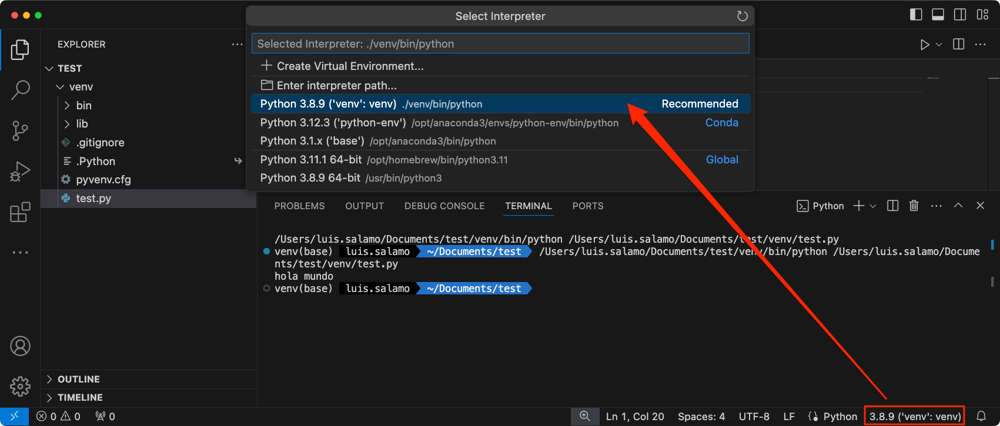

# [PACKAGE INSTALLER FOR PYTHON (PIP)](https://pip.pypa.io/) - [PyPI](https://pypi.org/project/pip/)

La herramienta más popular para instalar paquetes de Python y la que se incluye con las versiones modernas de Python.
- Proporciona las funciones principales esenciales para buscar, descargar e instalar paquetes desde [PyPI](https://pypi.org/) y otros índices de paquetes de Python.
- Gestiona dependencias, asegurando que todas las dependencias necesarias para un paquete estén instaladas
- Soporta la instalación de archivos .whl, archivos de distribución de origen, y otros formatos
- Facilita la gestión de entornos virtuales y la instalación de paquetes en entornos específicos

```bash
# Check the system Python version
python --version
> Python 3.11.7

# Check pip version
pip --version 
python -m pip --version
> pip 23.3.1 from /opt/anaconda3/lib/python3.11/site-packages/pip (python 3.11)

# Ensure pip, setuptools, and wheel are up to date
python3 -m pip install --upgrade pip setuptools wheel
```

## VIRTUAL ENVIRONMENTS

### [USING VENV](https://docs.python.org/3/library/venv.html)

```bash
# Create virtual environment
python3 -m venv [env_name]
python3 -m venv .venv

# Activate virtual environment
source .venv/bin/activate

# Desactivate virtual environment
deactivate
```

### [USING VIRTUALENV](https://virtualenv.pypa.io/en/stable/index.html) - [PyPI](https://pypi.org/project/virtualenv/)

Es una biblioteca que ofrece más funcionalidades que venv.Aunque puedes crear un entorno virtual usando venv con Python3, se recomienda que instales y use virtualenv en su lugar.

pip, [Setuptools](https://packaging.python.org/en/latest/key_projects/#setuptools) y [wheel](https://packaging.python.org/en/latest/key_projects/#wheel) siempre se instalan en entornos virtuales creados de forma predeterminada.

- **Setuptools**: es una biblioteca que facilita la creación, distribución y instalación de paquetes Python.
    - Define metadatos del paquete como nombre, versión, dependencias, etc., a través del archivo setup.py
    - Gestiona dependencias y otras configuraciones necesarias para el empaquetado y la instalación.
- **wheel**: es un formato de empaquetado para distribuciones binarias en Python. 
    - Genera archivos .whl, que son archivos ZIP con una estructura específica que permite a pip instalar el paquete rápidamente
    - Evita la necesidad de compilar el código fuente durante la instalación, lo que acelera el proceso y reduce problemas de dependencias de compilación

```bash
# Actualizar primero a pip3
pip install --upgrade pip
python3 -m pip install --upgrade pip

# Install virtualenv package
pip3 install virtualenv  

# Create virtual environment
python3 -m virtualenv [env_name]

# Activate virtual environment
source [env_name]/bin/activate

# Desactivate virtual environment
deactivate

# Delete virtual environment
rm -rf venv
```
[Python environments in VS Code](https://code.visualstudio.com/docs/python/environments)



### Create the environment from the requirements.txt file

Pip es una excelente opción para proyectos pequeños y medianos. Pip se apoya en un archivo llamado **requirements.txt** que lo utiliza para registrar las dependencias del proyecto. Contiene una lista de los paquetes de Python necesarios, junto con sus versiones específicas o restricciones de versión.

```bash
# Install package_name to latest version
pip install -r requirements.txt
python3 -m pip install -r requirements.txt
```

Después de instalar las dependencias usando pip, ejecuta el siguiente comando en la terminal:

```bash
# Registrar nuestras dependencias en el archivo requirements.txt
pip freeze > requirements.txt
```

Este comando captura todas las dependencias instaladas y sus versiones exactas en un archivo **requirements.txt**. Puedes incluir este archivo en tu repositorio para que otros desarrolladores puedan replicar el entorno.

Es una buena práctica ejecutar el comando pip freeze para actualizar el archivo **requirements.txt** cada vez que instalas una nueva dependencia o actualizas una existente en tu entorno de desarrollo

## VARIABLES

[Medium.com > Three Different Ways to Store Environment Variables](https://medium.com/@dataproducts/python-three-different-ways-to-store-environment-variables-15224952f31b)

```bash
# List any variables you may have
env

# Set environment variables
# 1. Use .env File to Store Environment Variables
# 2. Store Environment Variables in Virtual Environment
# 3. Storing Environment Variables in Dockerfile

# Unset the environment variable
conda env config vars unset my_var -n [env_name]
```

## [INSTALL PACKAGES](https://packaging.python.org/en/latest/tutorials/installing-packages)

The most common usage of pip is to install from the [Python Package Index (PyPI)](https://pypi.org/)

```bash
# Install package_name to latest version
python3 -m pip install [package_name]

# Install package_name to v5.0
python3 -m pip install [package_name]=5.0.0

# Upgrade an already installed SomeProject to the latest from PyPI.
python3 -m pip install --upgrade [package_name]

# List packages installed
pip list

# List packages installed "python"
pip list | grep python

# Show information about package
pip show [package_name]
```