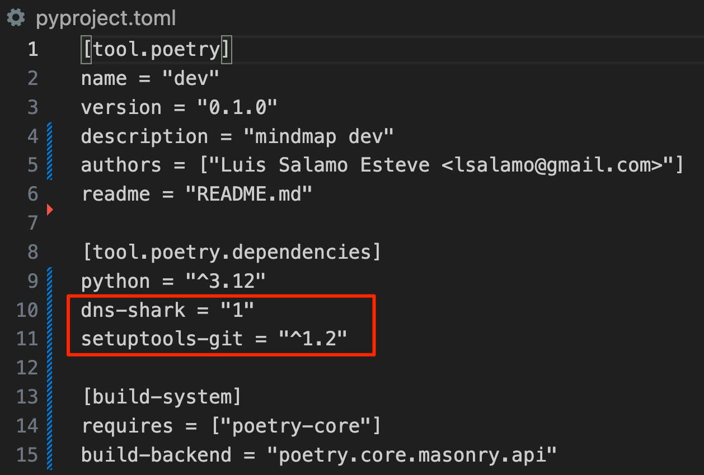
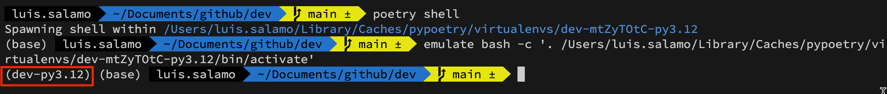

# [POETRY](https://python-poetry.org/)

Poetry es una herramienta de gestión de dependencias y empaquetado para proyectos de Python. Está diseñada para simplificar el proceso de configuración, instalación y actualización de dependencias, así como para facilitar la creación y publicación de paquetes Python. 

## [INSTALLATION](https://python-poetry.org/docs/#installation)

```bash
curl -sSL https://install.python-poetry.org | python3 -
```

## [BASIC COMMANDS](https://python-poetry.org/docs/cli/)

```bash
# Inicia un nuevo proyecto de Poetry en el directorio actual. Esto crea un archivo pyproject.toml, donde se definirán todas las dependencias y configuraciones del proyecto.
poetry init
```

```bash
# Crea un nuevo proyecto en un directorio específico, configurando automáticamente el archivo pyproject.toml.
poetry new [project_name]
poetry new dev
> dev
>   dev
>     __init__.py
>   tests
>     __init__.py
>   README.md
>   pyproject.toml
```

```bash
# Instala todas las dependencias listadas en pyproject.toml.
poetry install
> Creating virtualenv dev-mtZyTOtC-py3.12 in /Users/luis.salamo/Library/Caches/pypoetry/virtualenvs
> Package operations: 2 installs, 0 updates, 0 removals
>  - Installing dns-shark (1.0.0)
>  - Installing setuptools-git (1.2)

```bash
# Poetry configuration
poetry config --list
```


# Lista todas las dependencias del proyecto, junto con sus versiones.
poetry show
> dns-shark      1.0.0 A simple DNS resolver that can resolve a domain name to either an IPv4 or IPv6 ...
> setuptools-git 1.2   Setuptools revision control system plugin for Git
```


```bash
# Añade una nueva dependencia al proyecto y la instala. También actualiza pyproject.toml automáticamente.
poetry add [package_name]
poetry add requests
> Using version ^2.32.3 for requests
> Package operations: 5 installs, 0 updates, 0 removals
>  - Installing certifi (2024.6.2)
>  - Installing charset-normalizer (3.3.2)
>  - Installing idna (3.7)
>  - Installing urllib3 (2.2.1)
>  - Installing requests (2.32.3)

# Elimina una dependencia del proyecto y actualiza pyproject.toml.
poetry remove [package_name]
poetry remove requests
```

```bash
# Ejecutar un Comando en un Entorno Virtual
poetry run [package_name] [args]
poetry run python package_management/poetry/test_hola_mundo.py
```

```bash
# Abre una nueva shell en el entorno virtual del proyecto.
poetry shell
```


```bash
# Abre una nueva shell en el entorno virtual del proyecto.
poetry publish --build
> Building dev (0.1.0)
>  - Building sdist
```
