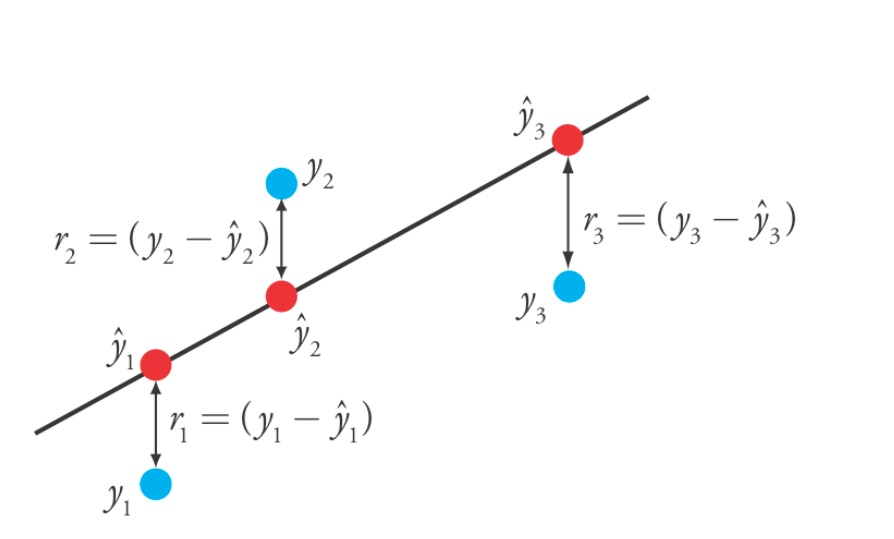
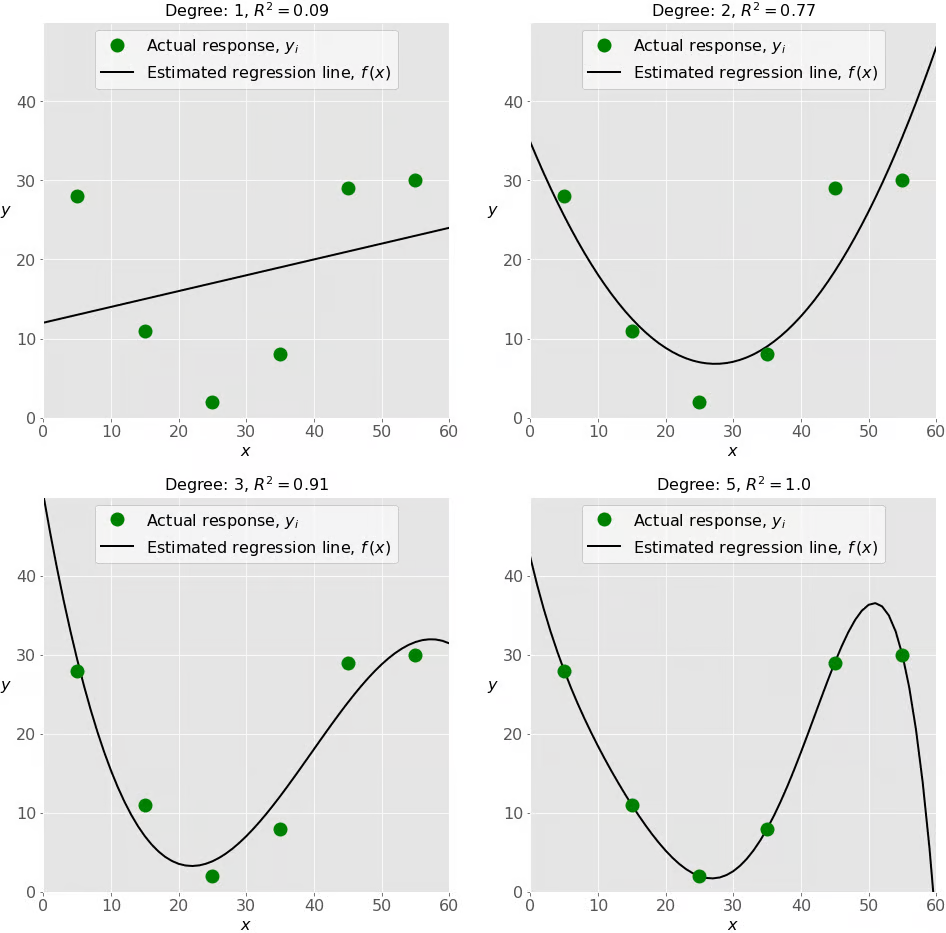

# MACHINE LEARNING

<!--TOC-->

- [1. Supervisado (Supervised)](#1-supervisado-supervised)
  - [Regression](#regression)
    - [Simple Linear regression](#simple-linear-regression)
    - [Multiple linear regression](#multiple-linear-regression)
    - [Polynomial linear regression](#polynomial-linear-regression)
  - [Classification](#classification)
- [2. Sin supervisión (Unsupervised)](#2-sin-supervisión-unsupervised)
- [3. Refuerzo (Reinforcement)](#3-refuerzo-reinforcement)
- [Tools:](#tools)
  - [1. TensorFlow](#1-tensorflow)
  - [2. Scikit-Learn](#2-scikit-learn)
  - [3. PyTorch](#3-pytorch)
  - [4. Keras](#4-keras)
  - [5. XGBoost](#5-xgboost)

<!--TOC-->

---

Los algoritmos de aprendizaje automático se dividen en tres áreas:

## 1. Supervisado (Supervised)

Supervised machine learning consiste en crear modelos que asignan con precisión las variables independientes /predictores, a las∫ variables dependientes / respuestas entrenando un modelo.

### Regression 

El análisis de regresión es una forma de técnica de modelado predictivo que investiga la relación entre una variable dependiente e independiente. Usa la relación entre variables para encontrar la recta de mejor ajuste o la ecuación de regresión que pueda usarse para hacer predicciones.

Este es un problema de regresión donde los datos relacionados con cada empleado representan una **observación (observation)**.

| Independent variables / predictores (x) | Dependent variables / respuestas (y)   | 
|:------------------------- |:--------------------------|
| Variables (features) utilizadas para hacer las predicciones | Variables objetivo o de respuesta que intentamos predecir o explicar |
| **EXAMPLE:** superficie, número de habitaciones, distancia al centro de la ciudad, etc. | **EXAMPLE:** precios de la vivienda | 

#### Simple Linear regression 

Se utiliza cuando hay una relación lineal entre una variable dependiente (o respuesta) y una sola variable independiente (predictora). 

- El objetivo es encontrar la línea que mejor ajuste a los datos de manera que minimice el error entre las predicciones y los valores reales.

- Supone que la relación entre las variables es lineal, es decir, la variable dependiente "y" cambia a un ritmo constante con la independiente "x".

- Es más simple y requiere menos datos para entrenarse correctamente. Sin embargo, no puede captar relaciones complejas.

$$y = b_{0} + b_{1}x + \epsilon$$

- "$b_{0}$" es el intercepto
- "$b_{1}$" es el coeficiente de la variable independiente (slope o pendiente)
- "$x$" es la variable independiente (predictors)
- "$\epsilon$" es el error (es la diferencia que existe entre el valor que nuestro modelo ha predicho y el valor real de la observación). Los valores "$b_{0}$" y "$b_{1}$" deben elegirse de manera que minimicen el error 

$$\epsilon = \sum_{i=1}^{n} (y_{i} - \hat{y}_{i})^2$$



**Error absoluto medio, mean absolute error (MAE)**

Esta métrica es una medida de la diferencia entre dos valores, es decir, nos permite saber que tan diferente es el valor predicho y el valor real u observado. Para que un error con valor positivo no cancele a un error con error negativo usamos el valor absoluto de la diferencia.

- Es una métrica de evaluación fácil de calcular.
- Todos los errores se ponderan en la misma escala ya que se toman valores absolutos.

$$MAE = \frac{\sum_{i=1}^{n} |y_{i} - \hat{y}_{i}|}{n}$$

- n: representa el número de observaciones
- $y_{i}$: representa el valor real
- $\hat{y}_{i}$: representa el valor predicho

**Error medio cuadrado, mean square error (MSE)**

Esta métrica es muy útil para saber que tan cerca es la línea de ajuste de nuestra regresión a las observaciones. Al igual que en caso anterior evitamos que un error con valor positivo anule a uno con valor negativo, pero en lugar de usar el valor absoluto, elevamos al cuadrado la diferencia.

- Un buen modelo tendrá un valor MSE más cercano a cero. 
- Es particularmente útil para eliminar valores atípicos con grandes errores del modelo al elevarlos al cuadrado.

$$MSE = \frac{\sum_{i=1}^{n} (y_{i} - \hat{y}_{i})^{2}}{n}$$

- n: representa el número de observaciones
- $y_{i}$: representa el valor real
- $\hat{y}_{i}$: representa el valor predicho

**Raíz del error medio cuadrado, root mean square error (RMSE)**

Como la métrica anterior nos da el resultado en unidades cuadradas, para poder interpretarlo más fácilmente sacamos la raíz cuadrada y de esta manera tenemos el valor en las unidades originales.

$$RMSE = \sqrt{\frac{\sum_{i=1}^{n} (y_{i} - \hat{y}_{i})^{2}}{n}}$$

**Coeficiente Determinación ($R^{2}$)**

Es una métrica que indica el rendimiento del modelo, nos indica que tanta variación tiene la variable dependiente que se puede predecir desde la variable independiente. 

- El valor de $R^{2}$ varía de 0 a 1; un valor cercano a 1 indica que el modelo explica bien la variabilidad de los datos, mientras que un $R^{2}$ cercano a 0 indica que el modelo explica muy poco.
- $R^{2}$ < 0,5 → Ajuste débil; 0,5 ≤ $R^{2}$ ≤ 0,8 → Ajuste moderado; $R^{2}$ > 0,8 → Ajuste fuerte

$$R^{2} = 1 - \frac{\sum_{i=1}^{n} (y_{i} - \hat{y}_{i})^{2}}{\sum_{i=1}^{n} (y_{i} - \bar{y}_{i})^{2}}$$

- n: representa el número de observaciones
- $y_{i}$: representa el valor real
- $\hat{y}_{i}$: representa el valor predicho
- $\bar{y}_{i}$: representa el valor de la media de los valores reales de "y"

**EXAMPLE** 

**Suposición**: El salario aumenta de manera constante con los años de experiencia.

**Modelo Simple Linear Regression**:

$y = b_{0} + b_{1}x + \epsilon$  
y = 30000 + 2000x   
donde "$b_{0}$ = 30.000 (salario base)" es el intercepto, "$b_{1}$=2.000 (incremento por año de experincia)", y "$\epsilon$" es el término de error aleatorio cuya función es agregar sesgo (bias).

| x (año) | y (salario) |
|---------|-------------|
| 0       | 30.000      |
| 1       | 32.000      |
| 2       | 34.000      |
| 3       | 36.000      |
| 4       | 38.000      |
| 5       | 40.000      |

#### Multiple linear regression

Se usa cuando hay una relación lineal entre una variable dependiente y más de una variable independiente.

- El objetivo es encontrar el mejor ajuste que considere múltiples variables predictoras para mejorar las predicciones.

$$y = b_{0} + b_{1}x_{1} + b_{2}x_{2} + \cdots + b_{n}x_{n} + \epsilon$$

- "$b_{0}$" es el intercepto
- "$b_{1}, b_{2} + \cdots + b_{n}$" son los coeficientes de las variables independiente (slopes o pendientes)
- "$x_{1}, x_{2} + \cdots + x_{n}$" son las variables independientes (predictors)
- "$\epsilon$" es el error (diferencias entre el valor real y el predicho). 

**EXAMPLE**

**Suposición**: Predecir el precio de las casas basándonos en dos factores:

- Size: El tamaño de la casa (en metros cuadrados)
- Bedrooms: El número de dormitorios

**Modelo Multiple Linear Regression**:

$y = b_{0} + b_{1}x_{1} + b_{2}x_{2} + \epsilon$  
$y = b_{0} + b_{1}.Size + b_{2}.Bedrooms + \epsilon$  
$y = 39.728,85 + 212,25 x Size + 5.672,18xBedrooms + \epsilon$  

- Intercept ($b_{0}$): 39.728,85 €. Este es el precio estimado de la vivienda cuando tanto el tamaño como el número de dormitorios son cero (que puede no ser realista, pero proporciona una línea de base).
- Coeficiente del tamaño ($b_{1}$): 212,25 €. Por cada metro cuadrado adicional, el precio aumenta unos 212,25 €.
- Coeficiente por dormitorios ($b_{2}$): 5.672,18 €. Por cada dormitorio adicional, el precio aumenta unos 5.672,18 €.


#### Polynomial linear regression 

Se utiliza cuando la relación entre las variables es no lineal y más compleja. A través de términos polinómicos (potencias de la variable independiente), se puede capturar esta complejidad. 

Un polinomio de grado 2 sería:

$$y = b_{0} + b_{1}x + b_{2}x^{2}$$

y para un polinomio de grado n:

$$y = b_{0} + b_{1}x + b_{2}x^{2} + \cdots + b_{n}x^{n}$$

**sobreajuste (overfitting)**

Puede captar relaciones complejas, pero a mayor grado del polinomio, existe un mayor riesgo de sobreajuste (overfitting), donde el modelo se ajusta demasiado a los datos de entrenamiento y tiene un mal desempeño en nuevos datos.



**EXAMPLE** 

**Suposición**: Si los datos muestran que el salario no solo aumenta sino que también hay una aceleración en el aumento después de ciertos años de experiencia debido a promociones y bonificaciones, podríamos ajustar un modelo polinómico

**Modelo polinómico (grado 2)**:

y = $b_{0} + b_{1}x + b_{2}x^{2}$  
y = 30000 + 2000x + $150x^{2}$   
El término cuadrático ($150x^{2}$) captura la aceleración en el incremento del salario.

| x (año) | y (salario) |
|---------|-------------|
| 0       | 30.000      |
| 1       | 32.150      |
| 2       | 34.600      |
| 3       | 37.350      |
| 4       | 40.400      |
| 5       | 43.750      |

### Classification 

## 2. Sin supervisión (Unsupervised)

## 3. Refuerzo (Reinforcement)

## Tools:

### 1. TensorFlow

[TensorFlow](https://www.tensorflow.org/) es una plataforma de código abierto de extremo a extremo para el aprendizaje automático.

### 2. Scikit-Learn

[Scikit-learn](https://scikit-learn.org/stable/) es una de las bibliotecas de machine learning más utilizadas en Python. 
- Construido sobre NumPy, SciPy y Matplotlib
- Es una herramienta sencilla y eficiente para tareas de análisis de datos predictivos.
- Links
    - [Datacamp > Python Machine Learning: Scikit-Learn Tutorial](https://www.datacamp.com/tutorial/machine-learning-python)
    - 

```bash
# Install package
pip install scikit-learn
```

### 3. PyTorch

Marco de aprendizaje profundo.

### 4. Keras

[Keras](https://keras.io/) es una API de redes neuronales de alto nivel, que se ejecuta sobre TensorFlow.

Tus modelos se ejecutan más rápido gracias a la compilación XLA con JAX y TensorFlow, y son más fáciles de implementar en todas las superficies gracias a los componentes de servicio de los ecosistemas TensorFlow y PyTorch

### 5. XGBoost

Librería optimizada de gradient boosting distribuido
